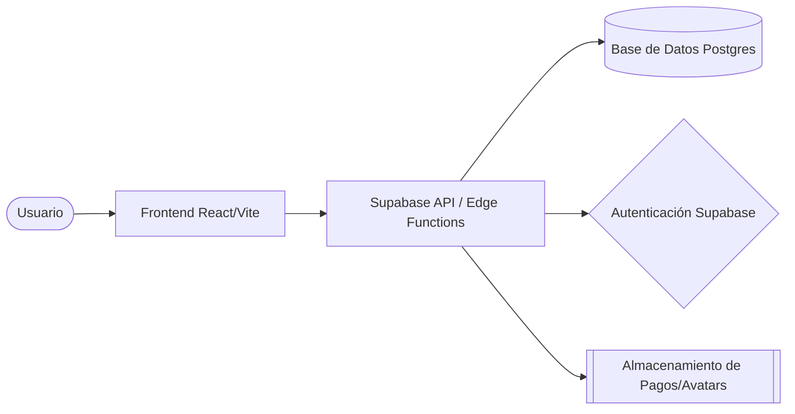

# 🏗️ TECHNICAL_SPEC.md
## Arquitectura de Sistema y Especificación Técnica

| Proyecto | Origen Sierra Nevada |
|----------|------------------|
| **MODUS AXON Hub** | [modus_axon](../../modus_axon) |
| **Arquitecto de IA** | MODUS AXON - Agent |
| **Ultima Actualización** | 10/03/2026 |
| **Versión** | v1.1.0 |

---

## 🏛️ Vista General de la Arquitectura (The High-level View)
*Descripción del flujo de datos entre capas (Frontend, API, DB).*

---

## 📊 Modelo de Datos (Data Schema - ERD)
*Relaciones principales y tablas clave.*

| Tabla | Propósito | Llaves Clave |
|-------|-----------|--------------|
| `profiles` | Perfiles y roles (Admin, Cliente, Proveedor) | `id` (UUID) |
| `products` | Catálogo de café de especialidad | `id` (Serial), `provider_id` (FK) |
| `orders` | Registro de pedidos y estados de flujo | `id` (UUID), `user_id` (FK null) |
| `order_items` | Detalle de productos por orden | `id` (UUID), `order_id` (FK), `product_id` (FK) |

---

## 🔗 Especificación de la API (Services Layer)
*Rutas críticas y su estructura de datos.*

### `orderService.ts`
- **`getUserOrders(userId)`**: Obtiene historial completo con items y nombres de productos.
- **`getOrderDetails(orderId)`**: Detalle profundo para rastreo universal.
- **`uploadPaymentProof(orderId, file)`**: Sube comprobantes al Storage y vincula al pedido.

### `shippingService.ts`
- **`calculateShipping(city)`**: Implementa lógica de costos de envío dinámicos por departamento.

---

## 🔒 Políticas de Seguridad (RBAC & RLS FIX)
- **RLS (Row Level Security)**: Cada usuario solo puede ver sus pedidos. Los proveedores ven solo sus items si el pedido es de sus productos.
- **SECURITY DEFINER Fix**: Las funciones `is_order_provider` y `is_order_owner` rompen recursión infinita en las políticas de `orders` y `order_items`.
- **JWT (JSON Web Tokens)**: Obligatorio para todas las solicitudes al backend relacionadas con perfiles.

---

## 🛠️ Herramientas de Desarrollo y Debugging
- **IDE**: Cursor / VS Code (Agente Antigravity).
- **Chrome DevTools**: React Profiler (Fix de renderizado de Checkout).
- **Supabase CLI**: Aplicación de migraciones de seguridad.
- **Postman**: Validación de payloads de órdenes.

---
**MODUS AXON** — Cualquier sistema, perfeccionado.
